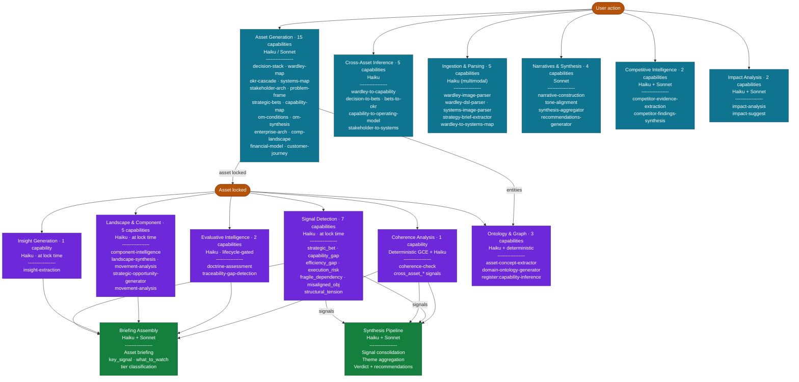
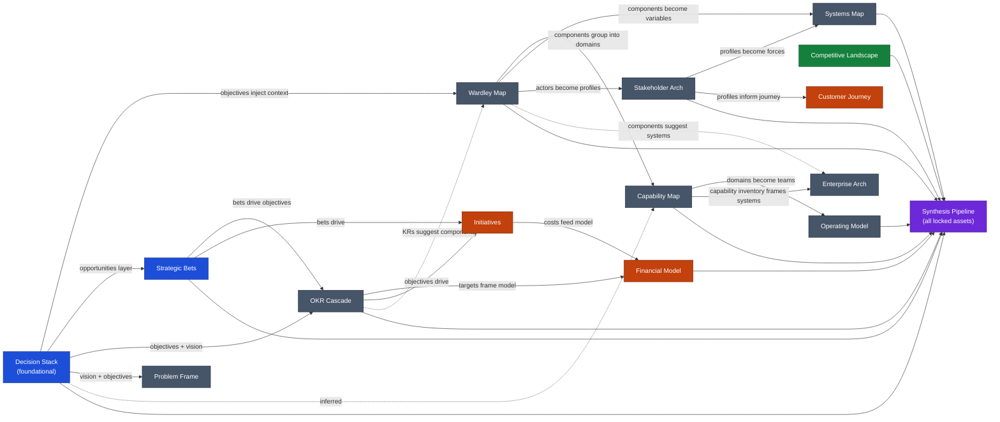
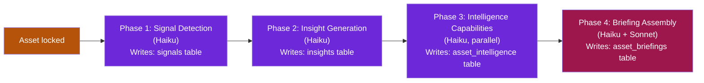
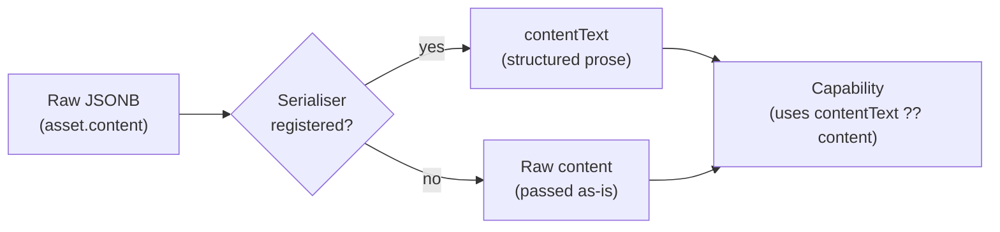
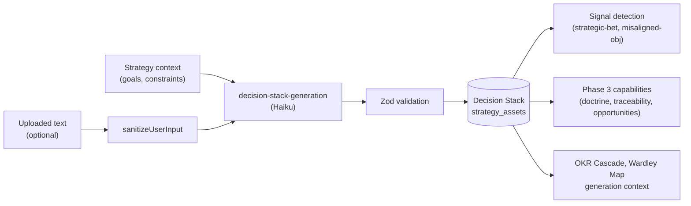
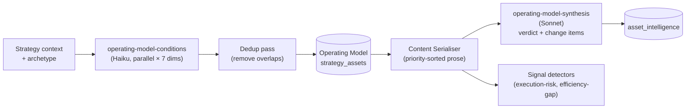
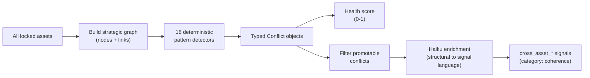
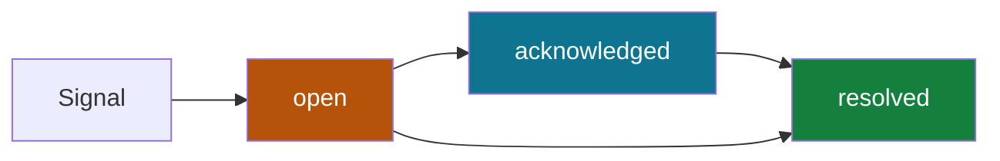
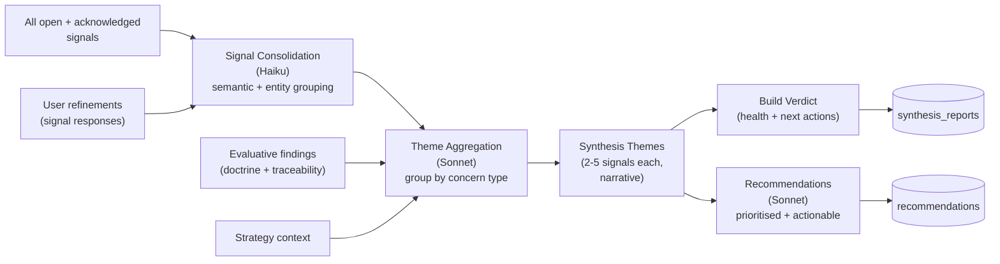

# StrategyOS Asset & Capability Reference

**Audience:** Technical stakeholders, investors, and team members who want to understand what data flows through the system, how it is transformed, and what the AI does at each step.

**Companion documents:**
- [`docs/intelligence-deep-dive.md`](intelligence-deep-dive.md) — narrative deep-dive on the intelligence pipeline, signal system, GCE, and ontology layer
- [`docs/ai-capabilities-reference.md`](ai-capabilities-reference.md) — full capability inventory with trigger map
- [`docs/DATA_FLOW_DIAGRAM.md`](DATA_FLOW_DIAGRAM.md) — seven Mermaid diagrams of the complete data flow

**Last updated:** 2026-05-04

---

## Diagrams

### Capability Map — All 52 Capabilities by Category

Shows when each capability category runs (lock-time vs. on-demand) and what it produces.



---

### Cross-Asset Data Lineage

Shows how assets inform each other — both as generation inputs and as intelligence context.



---

## How to Read This Document

Each asset and capability entry uses a consistent set of seven dimensions:

| Dimension | What it covers |
|-----------|---------------|
| **Purpose** | What this asset or capability does in plain English |
| **Data consumed** | Exact inputs — tables, fields, context flags |
| **AI / LLM** | Model ID, capability ID, or "none — deterministic" |
| **Pre-LLM transforms** | What happens to data before the Claude API call |
| **Post-LLM transforms** | Validation, enrichment, and persistence after the call |
| **Ontology / schema usage** | How taxonomies, enums, entity refs, or concern types improve output quality |
| **Dependencies, edge cases, risks** | Known failure modes, data quality risks, staleness guards |

---

## Part 1 — System Architecture

### What StrategyOS is actually doing

Most strategy tools are document editors. StrategyOS treats a strategy as a **structured knowledge graph**: each asset is a set of typed, schema-validated claims about an organisation — its capabilities, bets, dependencies, and stakeholders. AI operates on that graph, not on free text.

When a user locks an asset, they are committing structured claims to a typed schema. Everything the AI does downstream reads from that schema. This enables AI to reason about relationships between assets, detect structural contradictions, and produce analysis specific to the actual content — not generic advice.

### Architectural constraints (non-negotiable)

```
RULE 1: Capabilities never call each other
  → Orchestrator coordinates all multi-step flows

RULE 2: Capabilities never fetch data
  → Context assembler builds all prompt context from workspace state

RULE 3: All LLM calls go through client.ts
  → No direct Anthropic() instantiation elsewhere

RULE 4: Structured output via Zod schemas
  → JSON is never parsed without schema validation

RULE 5: AI calls are never passive
  → No GET endpoint, useEffect, or poll triggers a metered call
  → All LLM calls are behind explicit POST + user intent
```

### Two models in use

| Model | ID | Used for |
|-------|----|----------|
| Haiku | `claude-haiku-4-5-20251001` | Signal detection, tier classification, component analysis, inference — high-frequency, structured-output work |
| Sonnet | `claude-sonnet-4-6` | Briefing synthesis, theme aggregation, recommendations, OM v2 synthesis, impact analysis — quality-sensitive work |

### Four-phase intelligence pipeline

Every asset lock triggers this pipeline. Phases run sequentially; each reads from the persisted output of the prior phase.



Raw asset content is only read in Phase 1 and Phase 3. Every downstream stage reads from persisted, structured outputs. Adding more analysis capabilities costs linearly with the number of capabilities — not with the size or count of assets.

### Content serialisation

Before any capability processes an asset, the context assembler applies a content serialiser if one is registered for that asset type. Serialisers transform raw JSONB into readable prose that prioritises signal over structure.



Serialisers currently implemented: `operating_model`, `decision_stack`, `okr_cascade`. All others receive raw JSONB.

---

## Part 2 — Asset Reference

### Decision Stack

**Purpose:** A five-layer logical structure — Vision → Strategy → Objectives → Opportunities → Principles — that connects the organisation's direction to daily decision-making. The foundational asset: most other generation capabilities use it as context when available.

**Why it matters:** Each layer depends on the one above. Missing or unclear layers cause teams to stall or pull in different directions.

**Schema:** `src/core/assets/decision-stack.schema.ts`

| Dimension | Detail |
|-----------|--------|
| **Data consumed** | `strategy.title`, `domain`, `context.background`, `currentState`, `desiredState`, `goals[]`, `constraints[]`, `entryPath`, `uploadedText?`, `userGuidance?` |
| **AI / LLM** | `claude-haiku-4-5-20251001` · capability: `decision-stack-generation` |
| **Pre-LLM transforms** | Strategy context serialisation; goal/constraint injection; `sanitizeUserInput` on uploaded content; grounding instruction injection if `groundedOnly=true` |
| **Post-LLM transforms** | Zod validation (`DecisionStackDataSchema`); assumption log type enum enforcement; coherence conflicts extraction |
| **Ontology / schema usage** | `principle.type` enum (5 values: prioritisation / constraint / cultural / decision-making / risk) constrains LLM to valid principle categories; `entryPath` enum tracks source of authority; concern taxonomy: `misaligned-objective-detector` uses `causal_validity + internal_consistency`; `traceability-gap-detection` uses `coverage_completeness` |
| **Content serialiser** | ✅ `src/ai/content-serialisers/decision-stack.ts` — numbered decision blocks: title, chosen option, confidence, rationale |
| **Ingestion paths** | Document upload (`document-to-decision-stack`, Haiku); Mermaid DSL (`mermaid-to-decision-stack`, Haiku) |
| **Signal detectors** | `strategic-bet-detector`, `misaligned-objective-detector` |
| **Phase 3 capabilities** | `strategic-opportunity-generator`, `doctrine-assessment` (61 Wardley principles), `traceability-gap-detection` |
| **Cross-asset outputs** | Objectives feed `wardley-map-generation` prompt; `objectiveRef` links in OKR Cascade; `parentOpportunityId` in Strategic Bets |
| **Dependencies / risks** | Objectives layer is thin if `strategy.goals` are vague; Principles can be generic platitudes without stated constraints; no schema enforcement that objectives are mutually exclusive |



---

### OKR Cascade

**Purpose:** North Star Metric → Objectives → Key Results → Interventions. Bridges strategy to measurable outcomes. KRs are typed as outcome / leading_indicator / quality_guardrail to enforce measurement discipline.

**Why it matters:** Without typed KRs, teams optimise for activity (outputs) rather than outcomes. Ensures every team's work connects to something measurable.

**Schema:** `src/core/assets/asset-schemas.ts` (`OKRCascadeDataSchema`)

| Dimension | Detail |
|-----------|--------|
| **Data consumed** | Strategy context; `decision_stack` (objective IDs for `objectiveRef` links); `goals[]`; `entryPath`; `uploadedText?`; `userGuidance?` |
| **AI / LLM** | `claude-haiku-4-5-20251001` · capability: `okr-cascade-generation` |
| **Pre-LLM transforms** | Decision stack content injection (full JSON if available); goal-to-objective mapping framing; `sanitizeUserInput` on uploaded content |
| **Post-LLM transforms** | Zod validation; quality flag computation (`activity_kr`, `vanity_kr`, `no_leading_indicator`); stranded objective detection (objectives with no KRs) |
| **Ontology / schema usage** | `KeyResult.type` enum (3 values) constrains LLM to valid KR categories; `qualityFlags` serve as AI-generated quality ontology (auto-flagging bad KR patterns); `northStarMetric.failureModes` enum (revenue / activity / vanity / multiple) prevents non-MECE framing; concern taxonomy: `execution-risk-detector` uses `temporal_viability + uncertainty_fragility`; `capability-gap-detector` uses `coverage_completeness` |
| **Content serialiser** | ✅ `src/ai/content-serialisers/okr-cascade.ts` — numbered objective blocks with indented KR lines: description, target, current value, status |
| **Ingestion paths** | Document upload (`document-to-okr-cascade`, Haiku) |
| **Signal detectors** | `capability-gap-detector`, `execution-risk-detector` |
| **Phase 3 capabilities** | `strategic-opportunity-generator`, `doctrine-assessment`, `traceability-gap-detection` (critical: checks objectives-to-KRs, KRs-to-initiatives, bets-to-KRs with kill criteria) |
| **Cross-asset inputs** | `OKRItem.objectiveRef` links to Decision Stack objective IDs; `Strategic Bets.linkedOKRIds` references OKR objectives |
| **Dependencies / risks** | `objectiveRef` is a string (not a validated FK) — links break if Decision Stack is regenerated; KR quality flags are AI-inferred, not schema-enforced at input; North Star failure mode detection is heuristic |

---

### Wardley Map

**Purpose:** Visual positioning of components needed to deliver value across two axes — value chain visibility (y) and evolution (x: genesis → custom → product → commodity). Includes dependency edges, component positioning, and an assumption log.

**Why it matters:** Reveals where the strategy is investing in commodities vs. novel capabilities, where dependencies create risk, and what the market is likely to do next.

**Schema:** `src/core/assets/asset-schemas.ts` (`WardleyMapDataSchema`)

| Dimension | Detail |
|-----------|--------|
| **Data consumed** | `strategy.context` (background, currentState, desiredState, timeHorizon); `decision_stack` (full JSON if available); `basicQuestion`; `uploadedText?`; `userGuidance?`; `entryPath` |
| **AI / LLM** | `claude-haiku-4-5-20251001` · capability: `wardley-map-generation` |
| **Pre-LLM transforms** | Ghost Transformer instruction (consolidate jargon-heavy duplicates, log each in `assumptionLog` as `type='simplification'`); Decision Stack injection; evolution position rules injected in system prompt (genesis=0.0–0.25, custom=0.25–0.50, product=0.50–0.75, commodity=0.75–1.0); `sanitizeUserInput` |
| **Post-LLM transforms** | Zod validation; evolution position range enforcement (0.0–1.0); enum enforcement; ID format validation (`actor-*`, `need-*`, `comp-*`, `asmp-*` with hex suffixes) |
| **Ontology / schema usage** | `evolutionStage` enum (4 stages) — canonical Wardley evolution ontology with position ranges; `bbo` classification (build / buy / outsource) — component sourcing ontology; `pst` classification (pioneer / settler / town_planner) — role-based component ontology; `landscape-synthesis` injects `reference.ts` (Wardley climatic patterns, doctrine principles) as non-prompt knowledge; concern taxonomy: `fragile-dependency-detector` → `dependency_integrity`; `efficiency-gap-detector` → `allocation_commitment` |
| **Content serialiser** | ❌ None — has purpose-built capabilities (`component-intelligence`, `landscape-synthesis`) that operate directly on typed component arrays |
| **Ingestion paths** | Document upload; image upload (multimodal, Haiku); Wardley DSL text; Wardley Map → Systems Map conversion |
| **Signal detectors** | `structural-tension-detector`, `fragile-dependency-detector`, `efficiency-gap-detector` |
| **Phase 3 capabilities** | `component-intelligence` (per-component briefings for node selection); `landscape-synthesis` (strategic landscape: climatic patterns, inertia, pioneer/settler allocation); `movement-analysis` (evolution trajectories, commoditisation pressure); `strategic-opportunity-generator`; `doctrine-assessment` (61 principles); `traceability-gap-detection` |
| **Cross-asset outputs** | Components feed `wardley-to-capability-inference`; components feed `wardley-to-systems-map` conversion |
| **Dependencies / risks** | Evolution position is unconstrained — LLM can position cloud compute at 0.2 (genesis) instead of ~0.92 (commodity); Ghost Transformer relies on LLM judgment; component IDs use LLM-generated hex suffixes (not cryptographically random, could collide); `landscape-synthesis` injects reference.ts (hardcoded, not dynamically updated) |

---

### Systems Map

**Purpose:** Causal loop diagram (CLD) of variables and causal links. Shows reinforcing loops (R), balancing loops (B), leverage points, and a system narrative (what's running, what's resisting, what to watch).

**Why it matters:** Most strategic problems resist simple fixes because they're embedded in feedback loops. Reveals why problems persist, where interventions backfire, and where small changes produce outsized results.

**Schema:** `src/core/assets/asset-schemas.ts` (`SystemsMapDataSchema`)

| Dimension | Detail |
|-----------|--------|
| **Data consumed** | `strategy.context`; `challengeStatement?`; `desiredOutcome?`; `entryPath`; `uploadedText?`; `userGuidance?` |
| **AI / LLM** | `claude-haiku-4-5-20251001` · capability: `systems-map-generation` |
| **Pre-LLM transforms** | Loop ID format injection (stable IDs: R1, B2); cluster domain key injection; `sanitizeUserInput` |
| **Post-LLM transforms** | Zod validation; feedback loop type enforcement (reinforcing/balancing); `systemStory` nullable handling (legacy assets without `systemStory` — one-click regenerate offered) |
| **Ontology / schema usage** | `CldVariable.type` (4 types: auxiliary / stock / exogenous / risk-shock) — systems thinking variable ontology; `CausalLink.polarity` (+/−) — core causal ontology; `FeedbackLoop.type` (reinforcing / balancing) — archetype ontology; `FeedbackLoop.direction` (amplifying-problem / amplifying-solution / resisting-change); `FeedbackLoop.archetype` (freeform string, e.g. "growth_ceiling", "escalation"); concern taxonomy: `structural-tension-detector` → `internal_consistency` |
| **Content serialiser** | ❌ None — raw JSONB passed to capabilities |
| **Ingestion paths** | Document upload; image upload (multimodal); Mermaid diagram; Wardley Map → Systems Map conversion; Stakeholder Architecture → Systems inference |
| **Signal detectors** | `structural-tension-detector` |
| **Phase 3 capabilities** | `doctrine-assessment`, `traceability-gap-detection` |
| **Dependencies / risks** | `systemStory` introduced in a later schema version — legacy assets may be null; `LeveragePoint.rank` is AI-assigned, not deterministically verified; causal loop validation (no circular logic check beyond Zod) is absent |

---

### Stakeholder Architecture

**Purpose:** 4–8 profiled stakeholders with influence/interest mapping (2×2 grid), stance classification, engagement strategy, and needs. The primary asset for understanding the human landscape of a strategy.

**Why it matters:** You engage an internal team member differently from a strategic partner differently from a regulator. Unmanaged stakeholders are the most common cause of strategy failures that look like execution problems.

| Dimension | Detail |
|-----------|--------|
| **Data consumed** | `strategy.context`; `goals[]`; `entryPath`; `uploadedText?`; `userGuidance?` |
| **AI / LLM** | `claude-haiku-4-5-20251001` · capability: `stakeholder-arch-generation` |
| **Pre-LLM transforms** | Strategy context serialisation; stakeholder type framing (internal / external / partner inference from org description); goal context injection |
| **Post-LLM transforms** | Zod validation; influence/interest 2×2 grid normalisation; stance enum enforcement |
| **Ontology / schema usage** | `stance` enum (champion / supporter / neutral / skeptic / blocker); `engagementStrategy` typed options; entity extraction at lock time — stakeholders become `actor` nodes in the ontology graph; concern taxonomy: `stakeholder-alignment` concern type applied across coherence signals |
| **Content serialiser** | ❌ None |
| **Ingestion paths** | Document upload |
| **Signal detectors** | `execution-risk-detector` (surfaces stakeholder risk when no Stakeholder Architecture exists — `stakeholder_blindspot` GCE pattern P12) |
| **Phase 3 capabilities** | `doctrine-assessment`, `traceability-gap-detection`, `strategic-opportunity-generator` |
| **Cross-asset outputs** | Stakeholder profiles → `stakeholder-to-systems-inference` (Systems Map derivation); `stakeholder-to-capability-map` inference |
| **Dependencies / risks** | Influence/interest grid is AI-estimated, not grounded in data; engagement strategies are advisory (not machine-readable for downstream logic); no validation that stakeholders are non-overlapping |
| **Roadmap** | `boundary_class` (internal / boundary / external) and `interaction_patterns` fields being added per `docs/plans/intelligence-layer-and-ontology-brief.md` Part 2. Adds `external_dependency_risk` signal detector — fires when `boundary_class: external` AND `interaction_patterns` includes `dependency`. Influence map will render filled/ringed/hollow circles for the three boundary classes. |

---

### Problem Frame

**Purpose:** Structured problem definition: problem statement, current reality, desired outcome, key constraints, assumptions, and out-of-scope boundaries. Prevents teams from solving symptoms instead of root causes.

**Why it matters:** The quality of strategy output is bounded by the quality of problem framing. A well-formed Problem Frame reduces the risk of generating solutions to the wrong problem.

| Dimension | Detail |
|-----------|--------|
| **Data consumed** | `strategy.context`; `goals[]`; `constraints[]`; `entryPath`; `uploadedText?`; `userGuidance?` |
| **AI / LLM** | `claude-haiku-4-5-20251001` · capability: `problem-frame-generation` |
| **Pre-LLM transforms** | Strategy context serialisation; goal/constraint injection |
| **Post-LLM transforms** | Zod validation; assumption log extraction |
| **Ontology / schema usage** | `entryPath` enum; assumption log links to other assets; concern taxonomy applied: `causal_validity` and `coverage_completeness` |
| **Content serialiser** | ❌ None |
| **Signal detectors** | `misaligned-objective-detector` (checks problem frame alignment with Decision Stack goals) |
| **Phase 3 capabilities** | `doctrine-assessment`, `traceability-gap-detection`, `strategic-opportunity-generator` |
| **Dependencies / risks** | Problem Frame is often the first asset created — it may lack cross-asset context needed for strong framing; no automated validation that constraints are non-contradictory |

---

### Strategic Bets

**Purpose:** 3–8 irreversible, high-consequence commitments in the strategy — the conviction-layer decisions that foreclose options and shape all downstream choices. Each bet has rationale, time horizon, confidence, assumptions, and kill criteria.

**Why it matters:** Strategic bets are not objectives — they are the primary risk-carrying commitments. Making them explicit enables structured monitoring of whether assumptions hold.

| Dimension | Detail |
|-----------|--------|
| **Data consumed** | `strategy.context`; `decision_stack` (opportunities layer); `goals[]`; `entryPath`; `uploadedText?`; `userGuidance?` |
| **AI / LLM** | `claude-haiku-4-5-20251001` · capability: `strategic-bets-generation` |
| **Pre-LLM transforms** | Decision Stack opportunities injection; strategy context serialisation; bet framing rules (irreversibility, consequence threshold, time horizon) |
| **Post-LLM transforms** | Zod validation; `parentOpportunityId` linkage to Decision Stack; `linkedOKRIds` population |
| **Ontology / schema usage** | `confidence` enum; `timeHorizon` enum; `strategic_bet` signal type is informational — bets in Strategic Bets asset generate `strategic_bet` signals at lock time; concern taxonomy: `uncertainty_fragility` |
| **Content serialiser** | ❌ None |
| **Signal detectors** | `strategic-bet-detector` (identifies the primary irreversible commitments — informational, not a warning) |
| **Phase 3 capabilities** | `doctrine-assessment`, `traceability-gap-detection` (checks bets-to-KRs with kill criteria), `strategic-opportunity-generator` |
| **Cross-asset links** | `parentOpportunityId` → Decision Stack opportunity; `linkedOKRIds` → OKR Cascade objectives |
| **Dependencies / risks** | Bet generation is append-only (current state, build-spec-v2 Priority 15 remaining) — regeneration appends rather than replaces; no enforce that bet portfolio stays within 3–8 bound at schema level; kill criteria are free text |

---

### Capability Map

**Purpose:** Structured inventory of organisational capabilities organised into 3–5 domains, each with maturity ratings (developing / established / optimised). The bridge between Wardley Map evolution analysis and Operating Model design.

**Why it matters:** Capability maps answer "what do we need to be able to do?" before answering "how should we be organised?" Without a capability view, operating model design anchors to org structure rather than strategic need.

| Dimension | Detail |
|-----------|--------|
| **Data consumed** | `strategy.context`; `wardley_map` (components for inference); `decision_stack` (objectives); `entryPath`; `userGuidance?` |
| **AI / LLM** | `claude-haiku-4-5-20251001` · capability: `capability-map-generation` |
| **Pre-LLM transforms** | Wardley Map component injection (groups components into capability domains); strategy context serialisation |
| **Post-LLM transforms** | Zod validation; maturity enum enforcement; domain deduplication |
| **Ontology / schema usage** | `maturity` enum (developing / established / optimised); capability domains link to `register:capability-inference` APQC-inspired taxonomy; domain assignment feeds ontology concept classification |
| **Content serialiser** | ❌ None |
| **Ingestion paths** | `wardley-to-capability` inference (Wardley Map → Capability Map, groups components into domains) |
| **Signal detectors** | `capability-gap-detector` (checks strategy goals against existing capability coverage) |
| **Phase 3 capabilities** | `doctrine-assessment`, `traceability-gap-detection`, `strategic-opportunity-generator` |
| **Cross-asset outputs** | `capability-to-operating-model` inference produces Operating Model draft from capability domains |
| **Dependencies / risks** | Domain grouping is AI-estimated from Wardley Map — low confidence without a locked Wardley Map; maturity ratings are AI-estimated, not evidence-grounded by default |

---

### Competitive Landscape

**Purpose:** Per-competitor profiles (strengths, weaknesses, evolution stage), your positioning, and differentiation moats. Phase 1 (complete) adds per-competitor evidence ingestion → claim extraction → AI findings synthesis. Phase 2 (not started) adds cross-competitor theme synthesis.

**Why it matters:** Competitive positioning is only as good as the evidence behind it. Generic competitive analysis generates generic strategy.

| Dimension | Detail |
|-----------|--------|
| **Data consumed** | `strategy.context`; per-competitor: `competitor_evidence[]` (URLs, notes, uploaded content); `competitor_findings[]` (from prior analysis) |
| **AI / LLM — generation** | `claude-haiku-4-5-20251001` · capability: `competitive-landscape-generation` |
| **AI / LLM — evidence extraction** | `claude-haiku-4-5-20251001` · capability: `competitor-evidence-extraction` (1,500 tokens max) |
| **AI / LLM — findings synthesis** | `claude-sonnet-4-6` · capability: `competitor-findings-synthesis` (2,000 tokens max) |
| **Pre-LLM transforms** | Evidence extraction: per-evidence-item Haiku call extracts `ExtractedClaim[]`; synthesis: extracted claims aggregated for Sonnet synthesis; explicit `SYSTEM_PROMPT` locks JSON schema to prevent field collision (`confidence → evidenceStrength`) |
| **Post-LLM transforms** | Zod validation; `CompetitorFinding` schema: `{type, title, explanation, implication, tags, severity}` — threat / opportunity / assumption; `findings + lastAnalysedAt` written to `strategy_competitors` |
| **Ontology / schema usage** | `finding.type` enum (threat / opportunity / assumption); `finding.severity` enum; `finding.tags` (snake_case strings — not constrained); DirectionPill classification (evolution stage per competitor); concern taxonomy: coherence signals detect cross-asset conflicts between competitive landscape and Wardley Map |
| **Content serialiser** | ❌ None (landscape-synthesis operates directly on typed component arrays) |
| **Phase 3 capabilities** | `landscape-synthesis`, `strategic-opportunity-generator` |
| **Roadmap — Phase 2** | `competitive-cross-reference.ts` capability exists but is not called from any route; `competitor-profile-synthesis.ts` is dormant (candidate for deletion); "Save as signal" from findings (promote competitive finding to strategy signal) |
| **Dependencies / risks** | Evidence extraction is per-item Haiku call — cost scales linearly with evidence count; `AnalysisDot` in CompetitorRosterView has 30s tolerance for Postgres trigger race; Phase 2 cross-competitor synthesis requires all competitors to have findings — partial completion produces inconsistent cross-competitor comparison |

---

### Operating Model (v2)

**Purpose:** Assesses organisational readiness across 7 dimensions and 5 archetypes. V2 uses a condition-based model — each dimension contains multiple named conditions, each with a state (missing / emerging / operational / embedded) and criticality (critical / important / watch).

**Why it matters:** Strategy that ignores operating model readiness fails at execution. The Operating Model makes the gap between current state and required state concrete and actionable.

**Schema:** `operating-model-v2/types.ts` (`ConditionState`, `OperatingModelV2Data`)

| Dimension | Detail |
|-----------|--------|
| **Data consumed** | `strategy.context`; `wardley_map?`; `stakeholder_arch?`; archetype selection (product_led / enterprise / platform / professional_services / founder_led); `userGuidance?` |
| **AI / LLM — condition generation** | `claude-haiku-4-5-20251001` · capability: `operating-model-conditions` — parallel generation across 7 dimensions, dedup pass, cost guards |
| **AI / LLM — intelligence synthesis** | `claude-sonnet-4-6` · capability: `operating-model-synthesis` (OMS) — verdictSentence + changeItems + leverageItems |
| **Pre-LLM transforms** | Strategy context + archetype injection; OM content serialised to prose before any capability receives it |
| **Post-LLM transforms** | Zod validation; `ConditionState` enum enforcement; dedup pass (removes overlapping conditions across dimensions); `MigrationBanner` rendered for legacy dimension-format data |
| **Ontology / schema usage** | `ConditionState` enum (missing / emerging / operational / embedded); `criticality` enum (critical / important / watch); gap badge computed deterministically from `state × criticality` matrix (AT RISK / WARNING / DEVELOPING / HEALTHY); `dimensionId` maps to 7 canonical dimensions; serialiser sorts conditions by `(state_gap_score × criticality_weight)` descending — ensures highest-risk items appear first in all prompts |
| **Content serialiser** | ✅ `src/ai/content-serialisers/operating-model.ts` — dual-format: v2 conditions (state/criticality priority sort) + legacy dimensions fallback. Header: archetype + condition count. Summary: at-risk/warning/developing/healthy counts. Per-condition blocks: dimension label, state, requirement, why-it-matters |
| **Signal detectors** | `execution-risk-detector`, `efficiency-gap-detector` |
| **Phase 3 capabilities** | `operating-model-synthesis` (OMS — verdict sentence, top change items by criticality×gap, leverage items by readiness×criticality); `strategic-opportunity-generator` |
| **GCE patterns** | P14 (`missing_assumption`) applies when OM conditions lack documented evidence; P16–P18 financial patterns apply if Financial Model is locked |
| **Dependencies / risks** | MigrationBanner path for legacy dimension data not fully tested end-to-end; signal detection (`execution-risk-detector`, `efficiency-gap-detector`) populates health dashboard only after Strategy Pulse regeneration — per-asset intelligence generation does not write to the `signals` table; `operating-model-conditions` parallel generation can produce overlapping conditions across dimensions (dedup pass is best-effort) |



---

### Enterprise Architecture

**Purpose:** Systems organised by layer (presentation / application / data / infrastructure) with an integration map. Captures the technology landscape as it relates to strategic capability delivery.

| Dimension | Detail |
|-----------|--------|
| **Data consumed** | `strategy.context`; `capability_map?`; `wardley_map?`; `entryPath`; `userGuidance?` |
| **AI / LLM** | `claude-haiku-4-5-20251001` · capability: `enterprise-arch-generation` |
| **Pre-LLM transforms** | Strategy context serialisation; capability domain injection (if Capability Map available) |
| **Post-LLM transforms** | Zod validation; layer enum enforcement; integration map link validation |
| **Ontology / schema usage** | Layer enum (presentation / application / data / infrastructure); Wardley Map evolution stages inform component maturity in EA; ontology entity extraction: systems → `system` nodes, stakeholders → `actor` nodes |
| **Content serialiser** | ❌ None |
| **Signal detectors** | `fragile-dependency-detector` (infrastructure-layer components at genesis stage) |
| **Phase 3 capabilities** | `doctrine-assessment`, `traceability-gap-detection` |
| **Dependencies / risks** | EA without Capability Map input produces architecture divorced from strategic capability needs; integration map is AI-inferred, not grounded in actual system data |

---

### Financial Model

**Purpose:** Structured financial view of the strategy: revenue drivers, cost allocation by initiative, sensitivity scenarios, and investment posture. Uses a deterministic calculation engine — AI structures the model and suggests benchmark ranges; arithmetic is done mechanically.

**Why it matters:** Strategy without financial grounding is aspiration. The Financial Model makes resource allocation visible as a strategic choice.

| Dimension | Detail |
|-----------|--------|
| **Data consumed** | `strategy.context`; `initiatives[]` (from Phase 17); `okr_cascade?`; `strategic_bets?`; manual user inputs (revenue drivers, cost lines) |
| **AI / LLM** | `claude-haiku-4-5-20251001` · capability: `financial-model-generation` (structures the model and suggests benchmark ranges only) |
| **Pre-LLM transforms** | Initiative data injection; OKR target injection (revenue/outcome targets as framing); strategy context serialisation |
| **Post-LLM transforms** | Zod validation; deterministic calculation engine runs NPV, ROI, cost rollups, sensitivity scenarios on the validated structure — no AI involved in arithmetic |
| **Ontology / schema usage** | Investment posture classification (committed vs. recurring ratio); GCE patterns P16–P18 fire against Financial Model data: `capital_concentration` (single goal ≥ 60% of investment), `build_vs_buy_mismatch` (committed investment in commodity Wardley components), `allocation_vs_ambition` (posture contradicts strategic intent) |
| **Content serialiser** | ❌ None |
| **Signal detectors** | `unstrateted_spend` (cost allocation in capability area with zero strategic coverage); `strategy_execution_gap` (OKR targets outcomes where no initiatives exist) |
| **Phase 3 capabilities** | None specific — financial model intelligence surfaces through GCE patterns and coverage signals |
| **Dependencies / risks** | Deterministic engine requires valid numeric inputs — AI-generated benchmark ranges may not match user's actual cost structure; sensitivity scenarios require manual cost line entry before they're meaningful; `unstrateted_spend` signal requires both Financial Model and Capability Register to be locked |

---

### Customer Journey

**Purpose:** Stage-based journey map showing customer steps, touchpoints, pain points, and opportunities for intervention. Each stage has associated capabilities and coverage signals.

| Dimension | Detail |
|-----------|--------|
| **Data consumed** | `strategy.context`; `stakeholder_arch?` (customer/user stakeholder profiles); `wardley_map?` (touchpoint component mapping); `entryPath`; `userGuidance?` |
| **AI / LLM** | `claude-haiku-4-5-20251001` · capability: `customer-journey-generation` (Phase 18) |
| **Pre-LLM transforms** | Strategy context serialisation; stakeholder profile injection for relevant customer segments |
| **Post-LLM transforms** | Zod validation; stage ordering; touchpoint-to-capability linkage validation |
| **Ontology / schema usage** | Stage enum; touchpoint types; pain points link to `capability_gap` signals if no capability covers the touchpoint; concern taxonomy: `coverage_completeness` for capability coverage |
| **Content serialiser** | ❌ None |
| **Signal detectors** | `capability-gap-detector` (capabilities required at touchpoints but absent from Capability Map) |
| **Phase 3 capabilities** | `doctrine-assessment`, `strategic-opportunity-generator` |
| **Dependencies / risks** | Journey quality is bounded by stakeholder profile quality — generic personas produce generic journey stages |

---

### Narrative Threads *(output workspace — not an asset)*

**Purpose:** Rich strategic communications synthesised from the full strategy asset layer. User selects a template or purpose (board presentation, investor briefing, team alignment, external stakeholder report); the system assembles a structured narrative output. Not a strategy input asset — it is a dedicated output workspace with its own left nav section.

| Dimension | Detail |
|-----------|--------|
| **Data consumed** | All locked strategy assets (serialised via content assembler); `target_audience` (executive / investor / product / market); `focus` (full strategy / product / market / execution); `tone` (analytical / persuasive / inspirational / neutral) |
| **AI / LLM — narrative construction** | `claude-sonnet-4-6` · capability: `narrative-construction` — converts locked assets into structured narrative. Pre-tone — ToneAlignment shapes it next |
| **AI / LLM — tone alignment** | `claude-sonnet-4-6` · capability: `tone-alignment` — rewrites pre-tone narrative to match tone profile; preserves structure while changing voice |
| **Pre-LLM transforms** | Full asset context assembly (all locked assets via context assembler); audience and focus injection; pre-tone narrative passed to tone-alignment as input |
| **Post-LLM transforms** | Zod validation; narrative structured output; tone-aligned output replaces pre-tone draft |
| **Ontology / schema usage** | Asset content serialisers apply before assembly — OM and Decision Stack content arrives as prose; concern taxonomy and signal data not directly injected but available in strategy context |
| **Current status** | AI capabilities (`narrative-construction`, `tone-alignment`) built (Phase 7) but `narrative_threads` DB table was not built; template taxonomy and export format targets still being designed |
| **Roadmap** | Own left nav section (peer to Strategy Pulse, graph view); export to Cowork first, then slide deck via pptxgenjs; design decisions needed on template taxonomy, in-app editing depth, draft persistence |

---

## Part 3 — Core System Capabilities

### Intelligence Pipeline (Four Phases)

See `docs/intelligence-deep-dive.md` §The Four-Phase Intelligence Pipeline for the full narrative. Summary:

**Phase 1: Signal Detection (Haiku)**
- Single batch call (`strategic-signal-batch`) runs all relevant detection patterns for the asset type
- Falls back to individual detector capabilities if batch fails
- Signals persisted with `category: 'analysis'`, scoped to source asset
- Replace-by-asset-and-category: fresh signal set per lock without touching acknowledged/resolved signals

**Phase 2: Insight Generation (Haiku)**
- Business domain insights: observations, patterns, opportunities, constraints
- Higher-level than signals — patterns across content, not specific component flags
- Replaces previous insight batch per asset per lock

**Phase 3: Intelligence Capabilities (Haiku, parallel)**
- Content serialisers applied before capability execution (OM, Decision Stack, OKR Cascade)
- Capabilities write typed JSONB blobs to `asset_intelligence`, keyed by capability ID
- Phase 4 reads all outputs together

**Phase 4: Briefing Assembly (Haiku + Sonnet)**
- Haiku tier classification: urgent / cross_layer / noted; rewrites titles/bodies into plain business language; selects `key_signal`
- Sonnet briefing synthesis: headline, summary (3–5 specific observations), implications (2–3 paragraphs), `what_to_watch` (2–4 time-bound triggers)
- Validated against `AssetInsightResponseSchema` before persistence; last valid briefing preserved on failure

---

### Content Serialisers

| Dimension | Detail |
|-----------|--------|
| **Purpose** | Transform raw asset JSONB into structured prose before capabilities process it. Ensures capabilities receive signal rather than data structure. |
| **Data consumed** | Raw `asset.content` (JSONB from DB) |
| **AI / LLM** | None — deterministic, editorial transforms |
| **Transforms** | OM: sorts conditions by `(state_gap_score × criticality_weight)` descending; leads with archetype + summary counts; per-condition blocks with dimension label, state, requirement. Decision Stack: numbered decision blocks with chosen option + rationale. OKR: numbered objective blocks with indented KR lines, targets, status |
| **Fail-open behaviour** | If serialiser throws, `serialiseContent()` returns undefined; context assembler falls back to raw content; no capability breaks |
| **Coverage** | 3 asset types: operating_model, decision_stack, okr_cascade. Wardley Map omitted intentionally (has purpose-built capabilities). Others deferred pending need. |
| **Dependencies / risks** | Serialisers work from raw asset content only — no ontology concept injection at serialisation time; legacy OM dimension format handled with dual-format logic in OM serialiser |

---

### Global Coherence Engine (GCE)

The GCE is the most architecturally distinctive part of StrategyOS. It runs **entirely without AI** — a deterministic graph analysis engine that detects structural problems in the strategy graph.

| Dimension | Detail |
|-----------|--------|
| **Purpose** | Detect structural problems in the strategy graph — whether initiatives have owners, whether goals have passed their due dates, whether assets are making contradictory claims |
| **Data consumed** | Strategy + all locked assets; nodes: strategy, goals, initiatives, metrics, assets; links: `goal_of`, `measured_by`, `supports`, `references` |
| **AI / LLM** | None for pattern detection. One Haiku call for enrichment: translates structural findings into signal language for promotable conflicts |
| **18 patterns** | See `docs/intelligence-deep-dive.md` §The Global Coherence Engine for full pattern list |
| **Health score formula** | 30% asset completeness + 30% link density + 40% conflict-free ratio; conflict weights: critical×4, high×2, medium×1, low×0.5 |
| **Output** | Typed `Conflict` objects → filtered for promotable conflicts → Haiku enrichment → `cross_asset_*` signals; health score (0-1) |
| **Dependencies / risks** | Staleness guard too aggressive — coherence doesn't re-run after intelligence generation if strategy content unchanged (known bug, build-spec-v2 Track 6A cleanup); CoherenceCard doesn't re-fetch after background evaluation completes (known bug) |



---

### Ontology Layer

Eight-stage pipeline that extracts business concepts from locked assets, merges duplicates, builds typed relationships, and organises into business activity domains. See `docs/intelligence-deep-dive.md` §The Ontology Layer for full detail.

| Stage | What happens | AI? |
|-------|-------------|-----|
| 1 — Extraction | Asset-type-specific extractors pull actors, systems, processes, capabilities, data entities | Optional Haiku call for AI extraction path |
| 2 — Normalisation | Reject abstract terms; resolve types; assign canonical names; classify internal/external | No |
| 3 — Merging | Deduplicate across assets via entity reference / name match; single node with multiple source attributions | No |
| 4 — Label compression | Shorten labels for graph display (max 18 chars) | No |
| 5 — Edge building | Build typed relationships: structural (contains, depends_on, enables, measures, constrains, realised_by) and causal (causes, has_need, acts_on) | No |
| 6 — Domain assignment | Assign to 10 business activity domains; keyword heuristic first, Haiku classifier as fallback | Optional Haiku |
| 7 — Inference | Derive business objects from concepts; system archetype lookup (CRM, ERP → data entity suggestions at `speculative` confidence) | Heuristic only |
| 8 — Gap detection | Find concepts referenced by edges but with no corresponding node; single-asset concepts that should be multi-asset | No |

**Confidence tiers:** `declared` (user-stated) → `inferred` (AI/cross-asset derived) → `speculative` (AI-suggested, no direct evidence)

**Roadmap:** 8 new concept types being added per `docs/plans/intelligence-layer-and-ontology-brief.md` Part 1: `cadence`, `routine`, `practice`, `business_rule`, `policy`, `interaction_pattern`, `cultural_norm`, `rollup_logic`. Prompt + Zod schema change only — no migration required.

---

### Signal System

15 signal types across five categories. Signals are the AI's primary output format.



| Category | Types | Source |
|----------|-------|--------|
| Analysis signals (7) | `strategic_bet`, `capability_gap`, `efficiency_gap`, `execution_risk`, `fragile_dependency`, `misaligned_objective`, `structural_tension` | Asset lock — detector capabilities |
| Coherence signals (3) | `cross_asset_conflict`, `cross_asset_gap`, `cross_asset_amplification` | GCE + Haiku enrichment |
| Roll-Up Trap signals (3) | `empty_bucket`, `orphaned_initiative`, `thin_execution` | Initiative portfolio analysis (Phase 17) |
| Coverage signals (2) | `unstrateted_spend`, `strategy_execution_gap` | Capability Register + Financial Model (Phase 17/19) |
| Forthcoming (1) | `external_dependency_risk` | Stakeholder boundary model detector — fires on `boundary_class: external` + `dependency` interaction pattern |

**Concern taxonomy:** Every signal carries a `concernType` from 8 root types (dependency_integrity, allocation_commitment, internal_consistency, causal_validity, coverage_completeness, stakeholder_alignment, uncertainty_fragility, temporal_viability). `entityRefs` field (ontology concept IDs) enables deduplication: signals sharing the same `concernType` and overlapping `entityRefs` are merge candidates before the LLM consolidation pass.

**Replace-by-asset-and-category:** Each lock produces fresh signals for the source asset without touching acknowledged/resolved signals or signals from other assets.

---

### Synthesis Pipeline

The synthesis pipeline aggregates all strategy signals into themes and produces recommendations.



**Signal consolidation:** Pre-filters by `concernType` and `entityRefs` overlap before LLM dedup pass — reduces false merges and LLM calls. Staleness guard: synthesis checks signal count and pending refinement count to avoid redundant regeneration.

**User refinements in synthesis:** Signal responses (Add context / Reframe / Take action) are formatted alongside signals in synthesis prompts. Reframe text is biased as primary interpretation (overrides AI framing). A "N refinements pending" indicator on the Regenerate button surfaces when synthesis is stale relative to pending refinements.

---

### Evaluative Intelligence

A third analytical mode alongside observational (what's happening?) and relational (do assets agree?). Evaluative intelligence asks: **is your strategy well-formed against known strategic principles?**

| Capability | What it does | Model | Lifecycle gate |
|------------|-------------|-------|----------------|
| `doctrine-assessment` | Evaluates asset against curated strategic principles (Wardley doctrine). Draft → skip. Active → Phase 1–2 principles. Confirmed → all 4 phases. Max 2–3 findings per asset. Output in plain business language — no framework terminology. | Haiku | Active or Confirmed |
| `traceability-gap-detection` | Hybrid: Step 1 (zero cost) — pure TypeScript traversal of entity references to detect broken intent chains. Step 2 (Haiku, only if gaps found) — narrative synthesis of 2–3 most impactful gaps. Detects missing connections within existing assets, not missing asset types. | Haiku (conditional) | Active or Confirmed |

Evaluative findings are **findings-grade from birth** — they skip signal consolidation and enter the tier classification step directly. A deduplication pass runs before tier classification: findings that overlap with existing signals are suppressed; combined cap of 3 evaluative findings per asset.

**Known gap:** Evaluative findings reach the UI with raw capability output — no prose enrichment pass. Coherence conflicts have `enrichConflictDescriptions()` in `coherence-scan.ts`; evaluative findings have no equivalent. Fix needed: `enrichEvaluativeFindings()` workflow, mapping `principleArea` → clean title and `evidence + impact` → clear 2-sentence description. (build-spec-v2 Track 6A cleanup)

---

### Conversational Surface & MCP Tools

A Python MCP server (`mcp-server/`) serves both the embedded 440px Intelligence Panel and external hosts (Claude Desktop, claude.ai). 18 MCP tools provide read, write, analytical, and coaching capabilities.

| Dimension | Detail |
|-----------|--------|
| **Architecture** | Conversation endpoint: multi-turn sessions, model routing (Haiku for simple turns, Sonnet for analytical), prompt caching, sliding-window history (last 5 full, older summarised) |
| **Three stances** | Query (open-ended, default); Challenge (adversarial — surfaces 2–3 weaknesses from real data, `challenge_brief` card type); Assist (field-level — expressive or suggestive mode, triggered by `AssistAffordance` pill) |
| **Proactive delivery** | 4 urgency tiers (badge, inline nudge, toast, interruptive card) — all read existing cached DB data, zero AI calls |
| **Data consumed** | All 18 MCP tools read from DB via the same data layer as the main app; write tools support `confirm=false/true` pattern |
| **AI / LLM** | Model routing: Haiku for simple turns, Sonnet for analytical turns (`turn_router.py`) |
| **Cost controls** | Prompt caching (ephemeral, ~90% saving on system prompt); sliding window (5 full + summarised history); daily spend cap; turn limit warnings (15 warn, 20 suggest new session); context size monitoring (alert >30K input tokens) |
| **Dependencies / risks** | Python MCP server deployed to Google Cloud Run; `CONVERSATION_SERVER_URL` + `CONVERSATION_SHARED_SECRET` set in Vercel; Railway switch planned at go-to-market |

---

## Part 4 — Roadmap: What's Coming

### Ontology Type Extension *(intelligence-layer-and-ontology-brief.md Part 1)*

**8 new concept types** to be added to the extractor schema and generation prompt. No database migration required — prompt + Zod enum change only.

| New type | Definition | Domain cluster |
|----------|-----------|----------------|
| `cadence` | Repeating time-bound rhythm of review, delivery, or governance | Operating Rhythm |
| `routine` | Repeating operational pattern that delivers a capability | Operating Rhythm |
| `practice` | Named way of working — a method, discipline, or approach | Operating Rhythm |
| `business_rule` | Stated constraint on behaviour — if/then or never/always form | Governance |
| `policy` | Durable governance constraint, typically formally documented | Governance |
| `interaction_pattern` | Typed relationship between roles describing how they engage | Stakeholder/People |
| `cultural_norm` | Observed or stated behavioural pattern shaping how work is done | Culture |
| `rollup_logic` | Defined aggregation or scoring method | Closest metric domain |

**Total concept types after extension: 24** (16 existing + 8 new). No new signal detectors in this change — types added as vocabulary only.

---

### Stakeholder Boundary Model *(intelligence-layer-and-ontology-brief.md Part 2)*

Adds two new fields to every stakeholder record and a new signal detector.

**New fields:**
- `boundary_class`: `internal` / `boundary` (formal but legally outside) / `external` — with conservative default `external` for existing records
- `interaction_patterns[]`: `approval` / `escalation` / `review` / `co_decision` / `dependency` / `influence` / `compliance`

**Visual treatment:** Influence map 2×2 grid updated — filled circle (internal), ringed/double-border (boundary), hollow (external).

**New signal:** `external_dependency_risk` — fires when `boundary_class: external` AND `dependency` in `interaction_patterns`. Severity: high.

**Database:** Non-breaking data migration; existing records default to `boundary_class: external`, `interaction_patterns: []`.

---

### Intelligence Map View *(intelligence-layer-and-ontology-brief.md Part 3)*

A fourth tab in `UnifiedIntelligenceView.tsx` (`Findings | Signals | Health | Map`). Makes the intelligence pipeline visible as a **navigable graph** — answers "where are issues concentrated and what does that pattern tell me?" rather than "what are the issues?" (that's the list tabs).

**Three-layer node architecture:**
1. **Asset nodes (periphery)** — appear only when an intelligence item has no concept anchor; prevent orphaned nodes
2. **Concept nodes (centre)** — scaled by connection count; domain colour from ontology colour map; multi-zone hotspot ring
3. **Intelligence nodes (compass zones)** — Risk (top-right), Coherence (bottom-right), Opportunity (top-left, Phase 2), Strength (bottom-left, Phase 2)

**Phase 1 renders:** Risk nodes (internal filled triangles + landscape outlined triangles), Coherence finding nodes (concern-type-coloured pills), raw signal circles, concept nodes, asset fallback nodes.

**Force layout:** D3-force with gravitational zone bias (strength 0.3 per zone). Concept nodes pulled to centre. 9 non-negotiable rendering rules covering: minimum data threshold (≥3 assets, ≥8 intelligence items), orphan prevention, findings absorbing constituent signals, zoom-aware label rendering (hidden below 0.6), edge disclosure (max 5 at rest per concept node).

**No new API endpoints** — all data from existing endpoints.

---

### Phases 20–23 *(build-spec-v2 Track 3)*

| Phase | What | Dependencies |
|-------|------|-------------|
| 20 — Data Architecture | Structured data asset type | Phase 15b (enterprise map) |
| 22 — Implementation Roadmap | Roadmap view linked to initiatives | Phase 17 (initiatives) |
| 23 — Cross-Asset Intelligence | Intelligence aggregated across multiple strategies | All above |

Phase 21 (originally Market Analysis) closed — scope fulfilled by Competitive Landscape asset. Evaluative intelligence pipeline covers the strategic need for structured market framework analysis.

---

### Narrative Threads nav section *(build-spec-v2 Priority 19)*

Narrative Threads gets its own left nav section (peer to Strategy Pulse, graph view). Design decisions still needed: template/purpose taxonomy, how much output is AI-drafted vs. user-edited in-app, export format targets (Cowork first, then pptxgenjs), draft persistence/versioning.

---

## Part 5 — Companion Documents

| Document | Path | What it covers |
|----------|------|---------------|
| Intelligence deep-dive | `docs/intelligence-deep-dive.md` | Narrative walkthrough of intelligence pipeline, signal system, GCE, ontology layer, conversational surface, cost architecture |
| AI capabilities reference | `docs/ai-capabilities-reference.md` | Full capability inventory (44 capabilities, 9 categories), signal types reference, trigger map |
| Data flow diagrams | `docs/DATA_FLOW_DIAGRAM.md` | 7 Mermaid diagrams: system architecture, capability execution flow, intelligence assembly, synthesis pipeline, data transformations, ontology layers, failure paths, performance characteristics |
| Codebase analysis | `docs/codebase-analysis.json` | Architecture-level analysis of 12 key system components with AI function detail |
| Per-asset analysis | `docs/strategic-assets-analysis.json` | Detailed per-asset JSON covering all 14 asset types with schema, capability, detector, and ontology mappings |
| Build spec v2 | `docs/plans/build-spec-v2.md` | Verified current build state, remaining backlog tracks, priority sequence |
| Intelligence layer brief | `docs/plans/intelligence-layer-and-ontology-brief.md` | 3-part implementation brief: ontology extension, stakeholder boundary model, Intelligence Map view |
| Architecture decisions | `docs/architecture-decisions.md` | All ADRs (D-1 through D-23+) |
